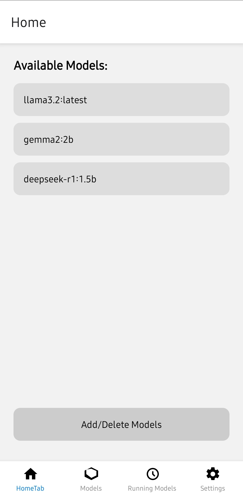
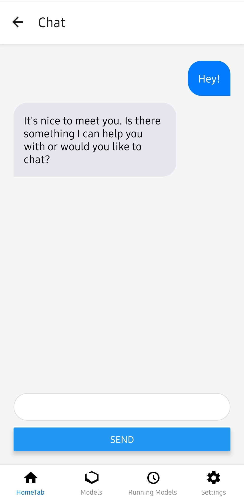
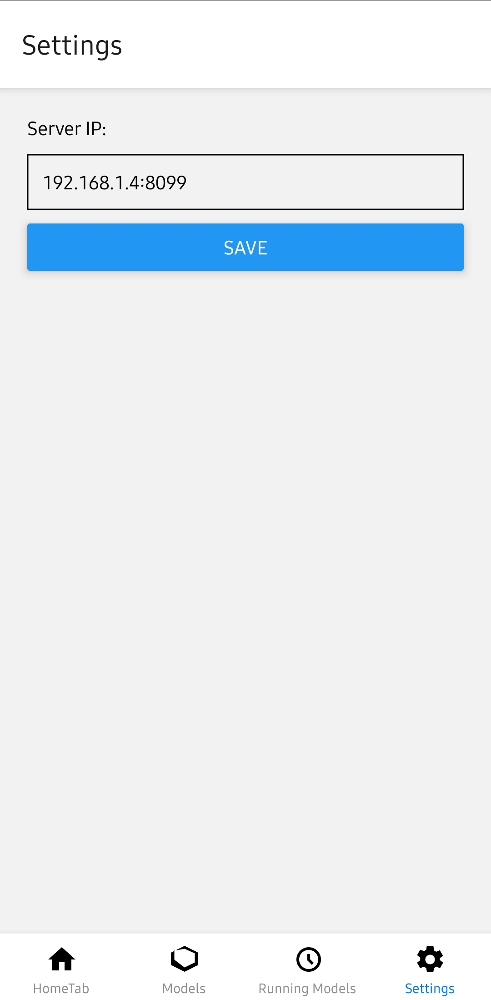
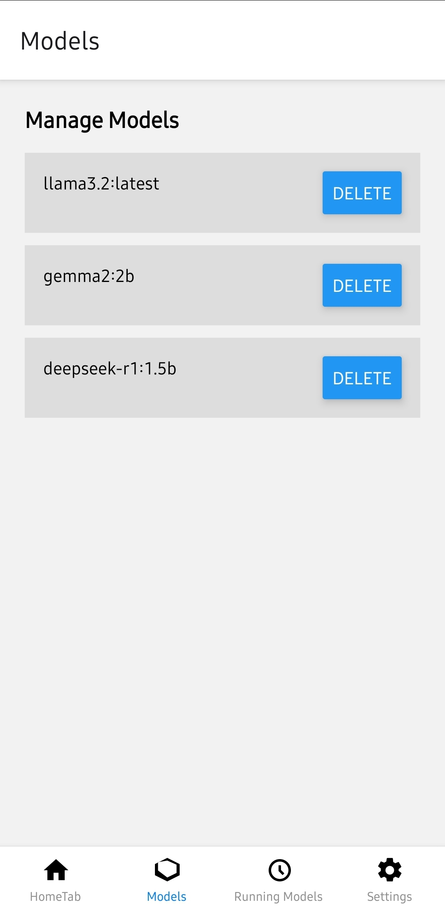

# **React Native Application: Ollama-Client**


## **Overview**

The `Ollama-Client` is a **React Native** application designed to interact with large language models (**LLMs**) hosted on a local server. It allows users to:

- View available models.
- Engage in text-based conversations with selected models.
- Configure server settings within the app.

**Note:**  
🚀 **On Linux systems, direct access to Ollama is restricted** over a local network. To overcome this, we use **Apache as a reverse proxy**, allowing devices on the same network to communicate with **Ollama's API via port `8099`** instead of its default `localhost:11434`.

---

## **Application Screens**

### **1. Home Screen**
- **Description:** Displays a list of available models fetched from the server. Users can select a model to initiate a chat session.
- **Components:**
  - List of models.
  - Button to navigate to the "Add/Delete Models" feature (currently a placeholder).
- **Screenshot:**
    {: width="40%"}

### **2. Chat Screen**
- **Description:** Enables users to have text-based conversations with the selected model.
- **Components:**
  - Display of chat messages.
  - Input field for user messages.
  - Send button to submit messages.
- **Screenshot:**
    {: width="40%"}

### **3. Settings Screen**
- **Description:** Allows users to configure the server **IP address** that the application communicates with.
- **Components:**
    - Input field to enter the server IP.
    - Save button to update the server IP.
- **Screenshot:**
    {: width="40%"}

### **4. Model Management Screen**
- **Description:** Allows users to add or delete models from the server.
- **Components:**
    - List of models with options to add or delete.
- **Screenshot:**
    {: width="40%"}

---

## **Ollama API Endpoints**

The application interacts with the following **Ollama API endpoints**:

### **1. Fetch Available Models**
- **Endpoint:** `GET /api/tags`
- **Description:** Retrieves a list of available models from the server.

### **2. Chat with a Model**
- **Endpoint:** `POST /api/chat`
- **Description:** Sends a user's message to the selected model and receives a response.
- **Payload Structure:**
  ```json
  {
    "model": "model_name",
    "messages": [
      {"role": "user", "content": "Your message here"}
    ]
  }
  ```

For detailed API documentation, please refer to the [Ollama API Documentation](https://github.com/ollama/ollama/blob/main/docs/api.md).

---

## **Running the Application**

To run the `ollama_react_native_app`, follow these steps:

### **1. Clone the Repository**
```sh
git clone hhttps://github.com/ishavverma/Ollama-Client.git
cd Ollama-Client
```

### **2. Install Dependencies**
Ensure you have [Node.js](https://nodejs.org/) installed. Then run:

```sh
npm install -g react-native-cli
npm install
```

### **3. Configure the Server**
- By default, the application communicates with the server at **localhost:11434**.
- To change this, navigate to the **Settings screen** within the app and update the **server IP address** accordingly.

### **4. Run the Application**
#### **For Android:**
```sh
npm start  # Start Metro bundler
npx react-native run-android
```
#### **For iOS:**
```sh
npm start  # Start Metro bundler
npx react-native run-ios
```

For comprehensive guidance on setting up the React Native environment, please refer to the [React Native Environment Setup](https://reactnative.dev/docs/environment-setup) documentation.

---

## **Linux: Mapping Ollama API to a LAN-Accessible Port (8099)**

### **Why?**
On **Linux**, Ollama **binds only to localhost**, preventing direct access from other devices on the network. To allow access from LAN-connected devices, we use **Apache as a reverse proxy** to map **port 8099** to **localhost:11434**.

### **Steps to Set Up Apache Reverse Proxy for Ollama**

#### **1. Install Apache**
```sh
sudo apt update && sudo apt install apache2 -y
```

#### **2. Enable Required Apache Modules**
```sh
sudo a2enmod proxy
sudo a2enmod proxy_http
sudo systemctl restart apache2
```

#### **3. Configure Apache Virtual Host for Port 8099**
Create a new Apache configuration file:
```sh
sudo nano /etc/apache2/sites-available/ollama-proxy.conf
```
Add the following content:
```
<VirtualHost *:8099>
    ServerName localhost
    ProxyPreserveHost On
    ProxyPass / http://localhost:11434/
    ProxyPassReverse / http://localhost:11434/
</VirtualHost>
```
Save the file (`CTRL + X`, then `Y`, then `ENTER`).

#### **4. Enable the New Configuration**
```sh
sudo a2ensite ollama-proxy.conf
sudo systemctl restart apache2
```

#### **5. Allow Port 8099 in Firewall**
```sh
sudo ufw allow 8099/tcp
```

#### **6. Test the Proxy Setup**
Run:
```sh
curl http://localhost:8099/api/tags
```
If the setup is correct, this should return a list of available models from Ollama.

### **How to Use This in the React Native App**
- Instead of using **`localhost:11434`**, enter **`your-linux-ip:8099`** in the **Settings Screen** of the app.
- Example:
  - If your **Linux machine's IP** is `192.168.1.100`, set the server **IP in the app to**:
    ```
    192.168.1.100:8099
    ```
- Now, **all devices on the local network** can communicate with the Ollama server.

---

## **Additional Notes**

### **Linux Middleware Configuration**
⚡ On **Linux systems**, direct access to Ollama is **restricted**.  
🚀 To facilitate communication between the **local network** and **Ollama's ports**, **Apache is configured as a reverse proxy**.  
🖥️ This allows the React Native app to access **Ollama from any device** on the same LAN.

### **Image Attachment Feature**
🖼️ The application is designed to support **image attachments** for models that can process visual inputs.  
❌ However, this feature is **currently under development** and will be available in future updates.

---

## **Support & Contributions**
For further assistance or to report issues, please **feel free to reach me out**. 🚀